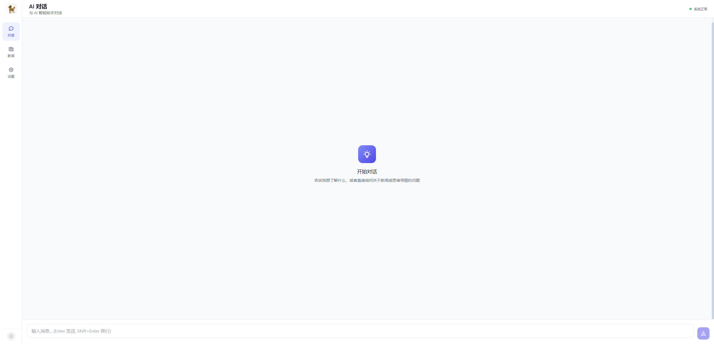
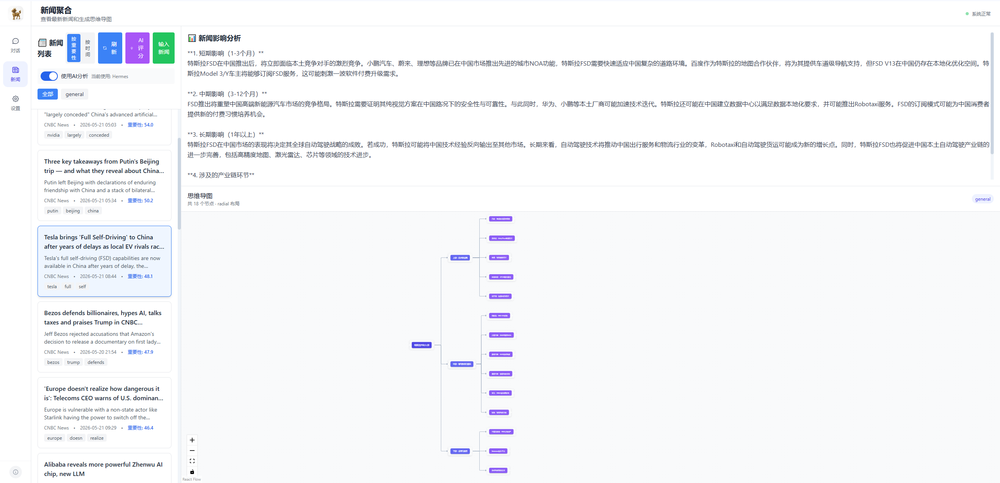

# Ensemble-Agent-Analyzer

<div align="center">


**A Multi-Agent Framework Integration System for News Sentiment Analysis with Industry Chain Visualization**

[中文文档](README_CN.md)

</div>

---

### Overview

Ensemble-Agent-Analyzer is a multi-Agent Framework integration system designed for intelligent news sentiment analysis. It allows users to leverage locally deployed AI Agents (such as **OpenClaw** or **Hermes**) based on their own preferences to perform in-depth analysis of news and public opinion. The system outputs comprehensive analysis results including **short-term, medium-term, and long-term impact assessments**, as well as the **industry chains** affected by the news events.

#### Key Features

- **Multi-Agent Framework Backend Support**: Seamlessly switch between OpenClaw, Hermes, or Local Analysis backends according to user preference
- **AI-Powered Chat**: Natural language interaction with AI agents, supporting WebSocket streaming responses and session history
- **Smart News Aggregation**: Multi-source RSS fetching with AI-based importance ranking, category filtering, and search capabilities
- **Industry Chain Analysis**: Deep analysis of news impact on upstream, midstream, and downstream industries with interactive visualization
- **Temporal Impact Assessment**: Analysis output covers short-term, medium-term, and long-term impacts of each news event
- **Interactive Mind Map Generation**: Visualize industry chain structures and news relationships with interactive mind maps powered by ReactFlow
- **AI-Based Importance Scoring**: Intelligent scoring (1-100) of news importance based on industry impact
- **Responsive Design**: Mobile-friendly interface with touch-optimized navigation

### Screenshots




### Architecture

```
+---------------------------------------------------------------+
|                      User Browser                              |
|  +--------------+  +----------------------------------------+  |
|  |   Sidebar    |  |           Main Content Area             |  |
|  |  +-- Chat    |  |  +-------------+--------------------+   |  |
|  |  +-- News    |  |  |  News List   |  Analysis Output   |   |  |
|  |  +-- Settings|  |  | (By Priority)|  (Text + Mind Map) |   |  |
|  +--------------+  +----------------------------------------+  |
+---------------------------------------------------------------+
                               |
                               v
+---------------------------------------------------------------+
|                   Python FastAPI Backend                      |
|  +----------+  +----------+  +------------+  +---------+     |
|  |Chat API  |  |News API  |  |MindMap API |  |WebSocket|     |
|  +----------+  +----------+  +------------+  +---------+     |
+---------------------------------------------------------------+
                               |
                               v
+---------------------------------------------------------------+
|              Multi-Agent Framework Engine Layer               |
|              OpenClaw / Hermes / Local Analysis               |
+---------------------------------------------------------------+
```

### Tech Stack

#### Backend
- **Framework**: Python FastAPI
- **Multi-Agent Framework Engine**: OpenClaw / Hermes / Local Analysis (configurable at runtime)
- **News Processing**: RSS parsing
- **Mind Map & Industry Chain**: NetworkX graph algorithms
- **Data Validation**: Pydantic

#### Frontend
- **Framework**: React 18 + TypeScript
- **Build Tool**: Vite
- **Styling**: Tailwind CSS
- **State Management**: Zustand
- **Data Fetching**: TanStack Query (React Query)
- **Visualization**: ReactFlow
- **HTTP Client**: Axios

### Quick Start

#### Prerequisites

- Python 3.9+
- Node.js 16+
- npm or yarn
- A locally deployed Agent Framework (OpenClaw or Hermes) for full AI analysis capabilities

> **Important**: Before starting the backend, ensure that the Gateway of the AI Agent Framework you intend to use is already running and accessible. For example, if using OpenClaw, verify that the OpenClaw Gateway is running at the configured URL (default: `http://localhost:18789`); if using Hermes, ensure the Hermes/Ollama service is running at the configured URL (default: `http://localhost:8642`). The backend will attempt to connect to these services when analysis requests are made.

#### 1. Backend Setup

```bash
cd backend

# Install dependencies
pip install -r requirements.txt

# Configure environment variables (optional)
cp .env.example .env
# Edit .env file with your agent backend settings

# Start the server
python run.py
```

The backend will run at http://localhost:8000

#### 2. Frontend Setup

```bash
cd frontend

# Install dependencies
npm install

# Start development server
npm run dev
```

The frontend will run at http://localhost:3000

#### 3. Access the Application

Open your browser and visit http://localhost:3000

### API Documentation

After starting the backend, access the interactive API documentation at: http://localhost:8000/docs

#### Main Endpoints

| Endpoint | Method | Description |
|----------|--------|-------------|
| `/api/chat/message` | POST | Send chat message |
| `/api/chat/ws/{session_id}` | WebSocket | WebSocket chat connection |
| `/api/news/` | GET | Get news list with pagination |
| `/api/news/{news_id}` | Get | Get news details |
| `/api/mindmap/from-news/{news_id}` | GET | Generate mind map from news |
| `/api/mindmap/analyze-and-generate` | POST | Analyze news and generate mind map with industry chain |
| `/api/news/rate-with-agent` | POST | Rate news importance with AI agent |
| `/health` | GET | Health check |

### Configuration

#### Backend Environment Variables

```env
# Server Configuration
HOST=0.0.0.0
PORT=8000
BACKEND_TYPE=LOCAL  # HERMES, OPENCLAW, LOCAL

# OpenClaw Configuration
OPENCLAW_API_URL=http://localhost:18789
OPENCLAW_API_KEY=your_api_key_here
OPENCLAW_MODEL=gpt-4

# Hermes Configuration
HERMES_API_URL=http://localhost:8642
HERMES_API_KEY=your_api_key_here
HERMES_MODEL=llama3
HERMES_API_FORMAT=openai

# Logging
LOG_LEVEL=info
```

#### News Sources Configuration

News sources are configured in `backend/news_sources.json`. You can add custom RSS sources by editing this file:

```json
{
  "rss_sources": [
    {
      "name": "News name",
      "url": "news_url",
      "category": "news_category"
    }
  ]
}
```

> **Note**: Users need to manually add their desired RSS feed URLs in `backend/news_sources.json`. The `category` field is used for news filtering in the frontend.

### Feature Guide

#### 1. Multi-Agent Framework Selection
- Navigate to "Settings" in the sidebar
- Choose your preferred AI Agent backend: **OpenClaw**, **Hermes**, or **Local Analysis**
- Customize LLM model name (e.g., gpt-4, claude-3, llama3)
- Changes take effect immediately without restart

#### 2. AI-Powered Chat
- Click "Chat" in the sidebar to start a conversation
- The chat uses the selected Agent backend for intelligent responses
- Supports both REST API and WebSocket for real-time streaming
- Session history is preserved across page refreshes

#### 3. Smart News Reading & Analysis
- Browse news sorted by AI-calculated importance
- Filter by categories or search for specific topics
- Hover over news items to see detailed previews
- **Click any news item** to trigger automatic deep analysis via the selected Agent

#### 4. Temporal Impact Assessment
- When a news article is selected, the system analyzes its impact across three time horizons:
  - **Short-term Impact**: Immediate market reactions and direct effects
  - **Medium-term Impact**: Transitional adjustments and secondary effects
  - **Long-term Impact**: Structural changes and strategic implications
- View text-based analysis in the upper-right panel

#### 5. Industry Chain Visualization
- Explore interactive mind map showing the complete industry chain structure
- Visualizes **upstream** (suppliers/raw materials), **midstream** (manufacturing/processing), and **downstream** (end-users/markets) industries
- Each node represents a specific industry or entity affected by the news
- Interactive zoom, pan, and node inspection powered by ReactFlow

#### 6. AI Importance Scoring
- Click the purple "AI Rating" button in the news panel
- Wait 30-60 seconds for batch scoring using the selected Agent
- News will be re-sorted by AI-assessed importance (1-100 scale)
- Scoring considers comprehensive industry impact beyond keyword matching

#### 7. Manual News Input
- Click "Input News" button to paste custom content
- System will analyze and generate industry chain mind map automatically

### Mobile Support

The application features responsive design optimized for mobile devices:
- Horizontal scrolling sidebar for easy navigation
- Vertically stacked layout on small screens
- Touch-optimized interactions
- Scrollable content areas for both analysis text and mind map

### Project Structure

```
ensemble-agent-analyzer/
|-- backend/                       # Python FastAPI Backend
|   |-- app/
|   |   |-- main.py               # Application entry point
|   |   |-- config.py             # Configuration management
|   |   |-- models/
|   |   |   |-- schemas.py        # Pydantic data models
|   |   |-- routes/
|   |   |   |-- chat.py           # Chat endpoints
|   |   |   |-- news.py           # News endpoints
|   |   |   |-- mindmap.py        # Mind map endpoints
|   |   |-- services/
|   |       |-- news_service.py            # News aggregation
|   |       |-- news_analysis_service.py   # AI-powered analysis
|   |       |-- mindmap_service.py         # Mind map generation
|   |       |-- hermes_service.py          # Hermes Agent integration
|   |       |-- openclaw_service.py        # OpenClaw Agent integration
|   |-- requirements.txt
|   |-- run.py                        # Startup script
|-- frontend/                     # React Frontend
|   |-- src/
|   |   |-- components/
|   |   |   |-- Chat/              # Chat components
|   |   |   |-- Layout/            # Layout components
|   |   |   |-- MindMap/           # Mind map components
|   |   |   |-- News/              # News components
|   |   |-- services/              # API services
|   |   |-- stores/                # Zustand state management
|   |   |-- types/                 # TypeScript types
|   |   |-- App.tsx                # Main application
|   |   |-- main.tsx               # Entry point
|   |-- public/
|   |   |-- icon.png               # Browser favicon
|   |   |-- icon2.jpg              # UI logo icon
|   |-- package.json
|   |-- vite.config.ts
|-- README.md                     # English README
|-- README_CN.md                  # Chinese README
|-- LICENSE                       # Apache License 2.0
```

### Development

#### Backend Development

```bash
cd backend

# Run with auto-reload
python run.py

# Or use uvicorn directly
uvicorn app.main:app --reload --host 0.0.0.0 --port 8000
```

#### Frontend Development

```bash
cd frontend

# Development mode with hot reload
npm run dev

# Build for production
npm run build

# Preview production build
npm run preview
```

### Testing

```bash
# Backend tests (if available)
cd backend
pytest

# Frontend tests (if available)
cd frontend
npm test
```

### License

This project is licensed under the Apache License 2.0 - see the [LICENSE](LICENSE) file for details.

```
Copyright 2024 Ensemble-Agent-Analyzer Contributors

Licensed under the Apache License, Version 2.0 (the "License");
you may not use this file except in compliance with the License.
You may obtain a copy of the License at

    http://www.apache.org/licenses/LICENSE-2.0

Unless required by applicable law or agreed to in writing, software
distributed under the License is distributed on an "AS IS" BASIS,
WITHOUT WARRANTIES OR CONDITIONS OF ANY KIND, either express or implied.
See the License for the specific language governing permissions and
limitations under the License.
```

### Contributing

Contributions are welcome! Please feel free to submit a Pull Request.

1. Fork the repository
2. Create your feature branch (`git checkout -b feature/AmazingFeature`)
3. Commit your changes (`git commit -m 'Add some AmazingFeature'`)
4. Push to the branch (`git push origin feature/AmazingFeature`)
5. Open a Pull Request

### Support

If you encounter any issues or have questions:
- Open an issue on GitHub
- Check existing documentation
- Review API docs at http://localhost:8000/docs

### Acknowledgments

- FastAPI for the excellent backend framework
- React and the vibrant frontend ecosystem
- OpenClaw and Hermes communities for AI agent technologies
- ReactFlow for the powerful graph visualization library
- All contributors and users of this project

---

<div align="center">

**Ensemble-Agent-Analyzer**

**Made with love by the Ensemble-Agent-Analyzer Team**

</div>
